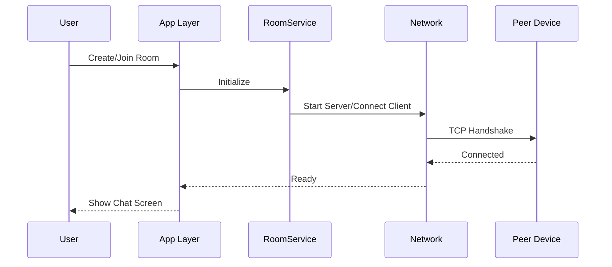

<!--
  README for common_com
  Generated: comprehensive, structured, with Mermaid diagrams for GitHub
-->
# common_com

[](https://flutter.dev)
[](#)
[](#license)

A cross-platform local communication and messaging framework built with Flutter — discover peers on a local network, exchange messages and files, and optionally connect to a backend service for logging and persistence.

---

**Quick Links**
- **Repo:** This file: [README.md](README.md)
- **Docs:** [Documentation folder](Documentation/)

## Key Features
- Local peer discovery (mDNS/UDP)
- Direct file transfer (TCP/UDP) and messaging
- Optional backend for logging, message persistence and discovery federation
- Cross-platform: Windows, macOS, Linux, iOS, Android, Web (best-effort)
- Lightweight, modular services and providers

## Badges & Icons
- Platform badges: rendered above via shields.io
- Use emojis for visual sections throughout the README to improve scannability.

---

## Architecture (High level)

Below are a compact architecture diagram and a short sequence flow (SVGs are stored in `assets/images/`).


### Message Flow Details

### Sequence (Discovery → Transfer)



---

## Project Structure

```
common_com/
├─ android/
├─ ios/
├─ linux/
├─ macos/
├─ web/
├─ windows/
├─ assets/
│  └─ images/
├─ build/
├─ lib/
│  ├─ config/
│  ├─ models/
│  ├─ providers/
│  ├─ screens/
│  └─ services/
├─ Documentation/
└─ README.md
```

Refer to the [Documentation folder](Documentation/) for extended guides and implementation notes.

---

## How It Works — Client Side

- Discovery: the app uses mDNS and UDP broadcasts to discover peers on the same LAN. That process is performed by `local_network_service.dart`.
- Connection: once a peer is discovered, the app negotiates a secure channel (handshake) and opens a TCP or UDP socket for data transfer.
- Messaging: messages are packaged into `message.dart` models and sent over the established channel. Files use chunked transfer using `file_transfer.dart`.
- Persistence: optional local persistence is handled by a saved messages service to cache or index transfers.

### Core responsibilities by module
- `services/local_network_service.dart`: discovery, mDNS, peer management
- `services/file_service.dart`: file chunking, transfer, resume logic
- `services/messaging_service.dart`: message send/receive, ack handling
- `providers/state_notifiers.dart`: app-wide state and reactive updates

---

## Backend (Optional) — How It Works

The backend is optional and used for central logging, user/peer registration, and long-term message storage. The typical flow:

1. The App sends event and usage logs to the backend via HTTP(S) endpoints.
2. The backend stores logs in a database, indexes messages for search, and can act as a relay if direct P2P transfer is not possible.
3. Authentication and access control are applied at the backend; the local network actions remain peer-to-peer as primary.

Backend components (example):
- REST API: receive logs, user registration
- WebSocket: real-time presence/controls
- DB: message and metadata persistence

---

## Local Development

Prerequisites: `flutter` installed and configured. See Flutter docs.

Run on a device/emulator:

```bash
flutter pub get
flutter run
```

Build for a specific platform (example Android):

```bash
flutter build apk
```

Testing: Use platform-specific emulators or multiple devices on the same LAN to test discovery and file transfer behavior.

---

## Configuration & Environment

- `lib/config/app_config.dart` contains runtime toggles (enable backend, use secure handshake, ports, timeouts).
- To enable backend logging set `appConfig.enableBackend = true` and configure `appConfig.backendUrl`.

---

## Security Considerations

- Always run discovery and transfers on trusted networks or ensure the handshake includes mutual authentication.
- Use TLS for any backend communications.
- Validate file types and sizes before accepting transfers to avoid resource exhaustion.

---

## Contributing

- Read [Documentation/IMPLEMENTATION_GUIDE.md](Documentation/IMPLEMENTATION_GUIDE.md) for architecture decisions and code style.
- Run `flutter analyze` and include tests for new services.

---

## FAQ

- Q: Is backend required? A: No — core P2P functionality works fully offline within a LAN.
- Q: Can transfers resume on interruption? A: Yes — `file_transfer.dart` supports chunked/resumable transfers.

---

## License

This project uses the MIT license. See [LICENSE](LICENSE) for details.

---

If you'd like, I can also generate PNG/SVG architecture images, add local icons under `assets/images/`, or craft a short demo README badge set optimized for GitHub with images — tell me which you'd prefer.
